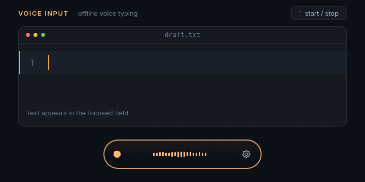

# Voice Input for Windows and Linux

Voice Input локально распознаёт речь через Whisper и печатает текст в любое
активное поле. Приложение работает в Windows 10/11 и Linux с Wayland или X11.
Режим `English` переводит поддерживаемую речь на английский.

Offline voice typing and speech-to-text for Windows and Linux. Dictate into any
focused text field or translate supported speech into English. Audio stays on
your computer.



## Скачать и установить / Download and install

### Windows

[Скачать VoiceInputSetup.exe / Download for Windows](https://github.com/nyavke-nya/voice-input/releases/latest/download/VoiceInputSetup.exe)

Подходят Windows 10 22H2 и Windows 11 x64. Сам Setup занимает примерно 230–300 МБ;
Python и всё для работы на CPU уже внутри.

1. Скачайте и запустите `VoiceInputSetup.exe`.
2. На ПК с NVIDIA оставьте включённым пункт ускорения: установщик скачает около
   1,3 ГБ cuBLAS/cuDNN. CUDA Toolkit отдельно не нужен.
3. Откройте Voice Input через меню `Пуск` или ярлык на рабочем столе.

On an NVIDIA PC, leave the acceleration option enabled. Setup downloads about
1.3 GB of GPU libraries during installation; a separate CUDA Toolkit is not required.

Установщик пока не подписан сертификатом. Если SmartScreen покажет неизвестного
издателя, нажмите `Подробнее` и `Выполнить в любом случае`. SHA-256 опубликован
на странице релиза.

The installer is not signed yet. Windows may show the same warning under
`More info` and `Run anyway`.

### Linux

[Скачать архив / Download for Linux (.tar.gz)](https://github.com/nyavke-nya/voice-input/archive/refs/heads/main.tar.gz)

Voice Input поддерживает Arch/CachyOS, Debian/Ubuntu, Fedora, openSUSE и Void.
Он работает в Hyprland, Sway, GNOME, KDE, Cinnamon и XFCE через Wayland или X11.

```bash
git clone https://github.com/nyavke-nya/voice-input.git
cd voice-input
./install.sh --dry-run
./install.sh
```

`--dry-run` только показывает план. Обычный запуск ставит зависимости,
настраивает интеграцию рабочего стола и в конце печатает горячую клавишу.
После ручной загрузки архива выполните две команды `./install.sh` в распакованной
папке. Alpine с musl пока не поддерживается.

The Linux installer supports Wayland and X11 and prints the configured hotkey
when it finishes.

## Как пользоваться / How to use

1. Поставьте курсор в поле, куда нужно ввести текст.
2. Нажмите горячую клавишу, указанную в настройках Voice Input.
3. Говорите. После короткой паузы текст появится в поле.
4. Нажмите горячую клавишу ещё раз, чтобы закончить запись раньше.

В Windows настройки открываются через меню `Пуск` или значок в трее. В Linux
используйте меню приложений или команду `voice-input --settings`.

При первом запуске скачивается выбранная модель Whisper. Первая диктовка может
обрабатываться несколько минут, поэтому не закрывайте приложение. Модель
скачивается один раз.

The first dictation may take several minutes while the Whisper model downloads.

| Режим / Mode | Что получится / Result |
| --- | --- |
| `Русский / Russian` | Распознавание русской речи |
| `English` | Перевод речи на английский |
| `Как в речи / As spoken` | Распознавание без перевода |

Whisper умеет переводить только на английский, поэтому других целевых языков в
меню нет.

## Скорость и модели / Performance

Скорость зависит от видеокарты или процессора, модели Whisper и длины фразы.
Voice Input автоматически использует совместимую NVIDIA GPU, а без неё работает
на CPU. Маленькие модели быстрее, большие обычно точнее.

Windows Setup не содержит CUDA: на ПК с NVIDIA он скачивает нужные библиотеки во
время установки. Без NVIDIA приложение ничего лишнего не загружает и работает на
CPU. Linux-установщик также загружает CUDA-библиотеки только при обнаружении NVIDIA.

## Логи и удаление / Logs and uninstall

| Система | Лог | Удаление |
| --- | --- | --- |
| Windows | `%LOCALAPPDATA%\Voice Input\logs\voice-input.log` | `Параметры > Приложения > Voice Input > Удалить` |
| Linux | `~/.cache/pill/daemon.log` | `./uninstall.sh` из папки проекта |

## Ошибки и связь / Bugs and contact

Создайте [GitHub issue](https://github.com/nyavke-nya/voice-input/issues/new/choose)
или напишите в Telegram: [@nyavke](https://t.me/nyavke). Укажите версию Voice
Input, операционную систему, рабочий стол и приложите лог.
